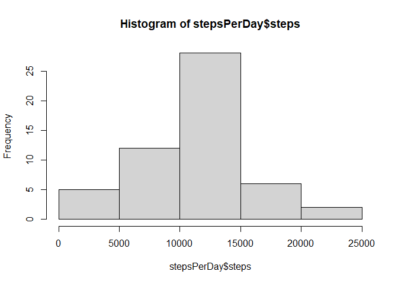
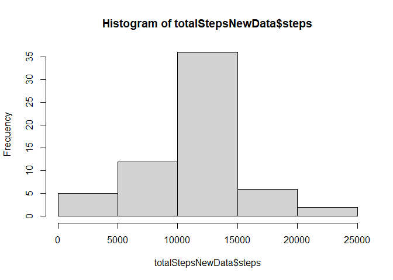
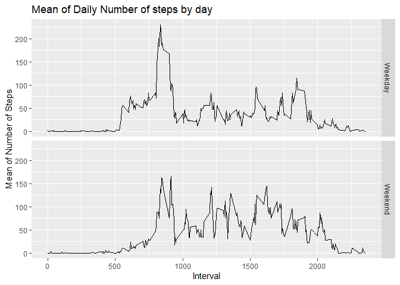

## Loading and preprocessing the data

```r
data<-read.csv("activity.csv")
summary(data)
```

```
##      steps            date              interval     
##  Min.   :  0.00   Length:17568       Min.   :   0.0  
##  1st Qu.:  0.00   Class :character   1st Qu.: 588.8  
##  Median :  0.00   Mode  :character   Median :1177.5  
##  Mean   : 37.38                      Mean   :1177.5  
##  3rd Qu.: 12.00                      3rd Qu.:1766.2  
##  Max.   :806.00                      Max.   :2355.0  
##  NA's   :2304
```


## What is mean total number of steps taken per day?
- Calculating the total number of steps taken per day and making histogram

```r
stepsPerDay<-aggregate(steps~date,data,FUN=sum,na.rm=T)
hist(stepsPerDay$steps)
```

<!-- -->
- Calculating the mean and median of the total number of steps taken per day

```r
mean(stepsPerDay$steps)
```

```
## [1] 10766.19
```

```r
median(stepsPerDay$steps)
```

```
## [1] 10765
```

## What is the average daily activity pattern?
- Time Series plot of 5 minute interval and the average number of steps taken

```r
stepsPerInterval<-aggregate(steps~interval,data,FUN=mean,na.rm=T)
plot(steps~interval,stepsPerInterval,type="l")
```

<!-- -->
- Maximum number of steps

```r
mostSteps<-stepsPerInterval[which.max(stepsPerInterval$steps),]
mostSteps$interval
```

```
## [1] 835
```


## Imputing missing values
- Calculating total number of missing values in the dataset

```r
totalNa<-sum(is.na(data))
totalNa
```

```
## [1] 2304
```
- Strategy for filling all the missing values

```r
fillEmptyValues<-function(interval){
  stepsPerInterval[stepsPerInterval$interval==interval,]$steps
}
```
- Creating a new Data set and filling in the missing values

```r
newData<-data
for(i in 1:nrow(newData)){
  if(is.na(newData[i,]$steps)){
    newData[i,]$steps<-fillEmptyValues(newData[i,]$interval)
  }
}
```
- Making histogram and calculating the mean and median

```r
totalStepsNewData<-aggregate(steps~date,newData,FUN=sum)
hist(totalStepsNewData$steps)
```

<!-- -->

```r
mean(totalStepsNewData$steps)
```

```
## [1] 10766.19
```

```r
median(totalStepsNewData$steps)
```

```
## [1] 10766.19
```


## Are there differences in activity patterns between weekdays and weekends?
- Creating new factor variable in the dataset

```r
newData$date<-as.Date(strptime(newData$date,format="%Y-%m-%d"))
newData$dayType<-sapply(newData$date,function(x){
  if(weekdays(x)=="Sunday" | weekdays(x)=="Saturday"){
    temp<-"Weekend"
    }
    else{
      temp<-"Weekday"
    }
    temp
})
```
- Making a panel plot containing a time series plot

```r
library(ggplot2)
dataPlot<-aggregate(steps~interval+dayType,newData,mean,na.rm=T)
plotObj<-ggplot(dataPlot,aes(x=interval,y=steps))+ xlab("Interval") +ylab("Mean of Number of Steps") +geom_line()+ ggtitle("Mean of Daily Number of steps by day")+facet_grid(dayType~.)
print(plotObj)
```

<!-- -->
